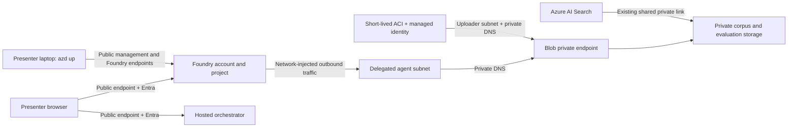

# Hybrid evaluation networking plan

Date: 1 August 2026
Status: implemented and validated

## Objective

Enable Foundry-managed evaluations to use policy-compliant private Blob storage while
keeping the Foundry portal, hosted-agent endpoint and local `azd up` workflow reachable
from the presenter's laptop over the public internet.

This plan also defines an honest way to show the corpus without claiming that a local
folder proves cloud storage contents.

## Verified constraints

- Organizational controls leave Blob public network access disabled after deployment.
- Foundry evaluation runs fail before grading at the Asset Store
  `temporaryDataReference` operation. Their result count is zero.
- Inline and pre-uploaded `purpose="evals"` datasets fail through the same network path.
- Storage is connected to the project and both Foundry identities have the required Blob
  data roles. RBAC alone does not create network reachability.
- Search reaches Blob through its approved shared private link and should keep doing so.
- The existing Foundry account has no network injection. Hosted-agent network injection
  must be configured when the account is created, so the account cannot be upgraded in
  place.
- Azure portal Storage Browser and Azure Storage Explorer run from the user's machine.
  They cannot reach a private Blob endpoint unless that machine has VPN, ExpressRoute or
  a jump-host path into the VNet.

## Target topology

The `demo-vnet` environment is the accepted deployment. It passed the complete
evaluation and rehearsal criteria before the fallback environment was removed.

Minimum new network resources:

- One VNet in `westus3`.
- One `/24` subnet delegated to `Microsoft.App/environments` for Foundry network
  injection.
- One private-endpoint subnet.
- One subnet delegated to Container Instances for private corpus upload.
- One Blob private endpoint.
- `privatelink.blob.core.windows.net` private DNS zone, VNet link and endpoint zone group.
- One persistent uploader managed identity with narrow Blob and ACR roles.

Keep Foundry `publicNetworkAccess` enabled and do not create a Foundry inbound private
endpoint for the demo topology. The network injection is for outbound evaluation access
to private Blob. This hybrid variation must be validated in a parallel environment before
cutover because the Microsoft evaluation-only sample makes both inbound and outbound
paths private.

## Implementation sequence

1. **Parallel network proof**
   - Create a new `demo-vnet` azd environment and a new deterministic Foundry account
     name. Do not modify or delete the working `demo` account.
   - Add the VNet, delegated subnet, private-endpoint subnet, Blob private endpoint and
     Blob private DNS.
   - Create the new Foundry account with `networkInjections` configured at creation while
     retaining public inbound access.
   - Connect the existing private storage account and assign current Foundry User and
     Blob data roles.

2. **Evaluation proof**
   - Upload a two-row eval-purpose JSONL file.
   - Run one deterministic portal evaluation.
   - Require a nonzero result count and no `UnauthorizedUserAction` before running the
     25-case comparison.
   - Run the 25-case mini/reasoning suite and retain the durable file IDs and run IDs.

3. **Agent migration proof**
   - Register the MCP, Foundry IQ and specialist connections in the new project.
   - Register specialists and deploy the hosted orchestrator from source.
   - Validate the Invocations endpoint, approval resume and portal traces.
   - Confirm the Foundry portal remains usable from the presenter laptop without VPN.

4. **One-command cutover**
   - Put every network resource, role assignment, connection and registration hook behind
     `azd up`.
   - Run `azd provision --preview`, then a clean `azd up` in the parallel environment.
   - Switch the local front door to the replacement endpoint only after all acceptance
     checks pass.
   - Retain the old account until rehearsal succeeds; remove it afterward to avoid
     duplicate model capacity and portal artifacts.

## Corpus evidence for the demo

Direct Blob browsing is not an MVP requirement because it would add P2S VPN or a
Bastion/VM solely for a presentation screenshot.

Create two local, presenter-friendly artifacts during `azd up`:

1. A public-only folder containing exactly the 11 PDFs uploaded under `pdf/public`:
   `os-001` through `os-008`, `cd-001`, `cd-002`, and `me-001`.
2. A deployment receipt generated by an Azure-side worker with each blob path, document
   ID, content length and SHA-256 hash. The command must fail if the receipt differs from
   the public subset of the corpus manifest.

During the walkthrough:

- Open the public-only local folder and describe it as the source set uploaded by `azd`.
- Open the deployment receipt as proof of the private container inventory.
- Show the Foundry IQ knowledge source, generated index and cited retrieval results as
  proof that the cloud service consumed those documents.
- State that `pm-001` through `pm-003` are private-side fixtures and are deliberately not
  uploaded to the public Blob prefix.

Optional after the customer session: add P2S VPN for direct Storage Explorer access. It
is not justified on the critical demo path.

## Exit criteria

- [x] A clean parallel `azd up` creates networking, Foundry artifacts and hosted services.
- [x] Foundry portal pages and the hosted endpoint work from the presenter laptop without
  VPN.
- [x] Storage remains `publicNetworkAccess: Disabled` and shared-key access remains off.
- [x] A file-backed evaluation processes at least one row through private storage.
- [x] The full 25-case portal evaluation completes and exposes sample-level metrics.
- [x] Search still reports 11 public source documents through its shared private link.
- [x] The Azure-side inventory receipt matches the 11-document public manifest subset.
- [x] No `pm-*` document appears in Blob, Foundry IQ or the public-only demo folder.
- [x] The old Foundry account is removed only after the replacement passes rehearsal.

## Final validation

`azd up --environment demo-vnet` completed the private upload, 11-document IQ ingestion,
two-row evaluation-storage smoke, MCP deployment, hosted orchestrator v3 deployment and
specialist contract smokes. Final evaluation
`eval_b23afc8b99554c30a7c8af566abb375d` retained two 25-row runs; both completed with
25 passed, zero failed and zero errored rows. The accepted Blob inventory contains the
exact 11 public manifest paths and hashes.
